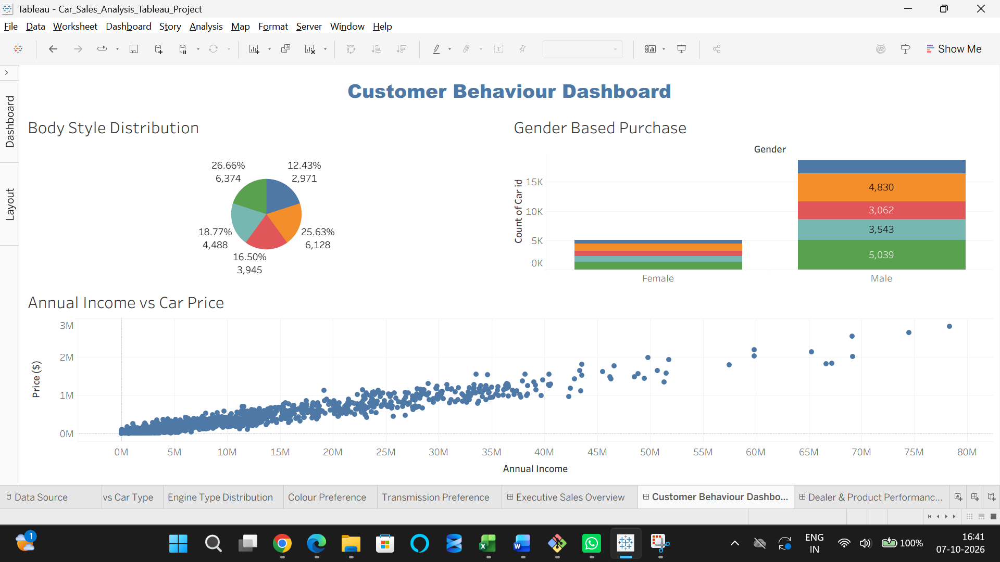
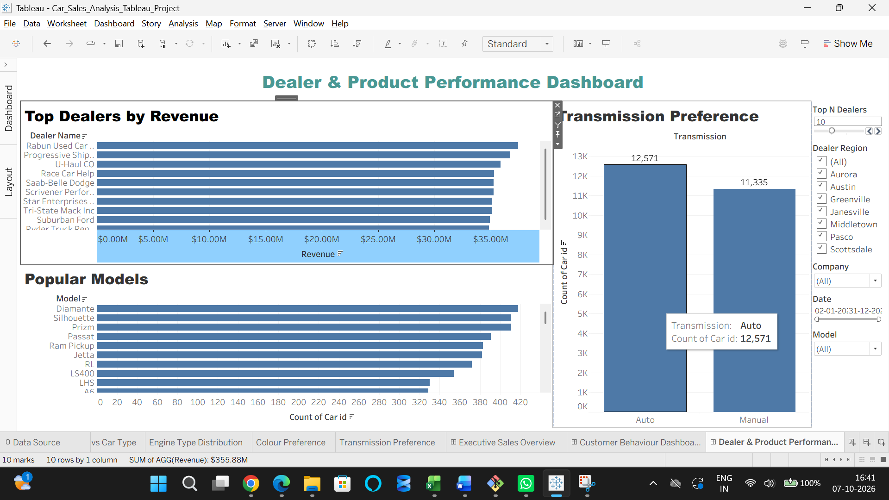
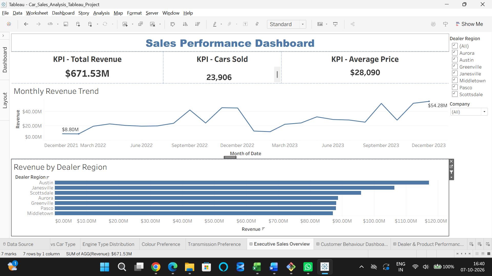

# Car Sales Analysis — Tableau Business Analyst Project

## 📊 Project Overview

This project analyzes car sales data using Tableau to understand customer behavior, vehicle preferences, dealer performance, and product performance.

The analysis focuses on identifying patterns in customer purchasing behavior and understanding which dealers, manufacturers, models, and vehicle characteristics perform best.

## 🎯 Business Questions

The project answers key business questions such as:

1. Which dealer sells the most vehicles?
2. Which region generates the highest revenue?
3. Which manufacturer dominates sales?
4. Which body style is most preferred?
5. Do high-income customers buy expensive cars?
6. Does gender influence car selection?
7. Do customers prefer automatic cars?
8. Which colour sells the most?

## 🛠️ Tools & Technologies

- Tableau
- Excel
- Data Visualization
- Calculated Fields
- Filters
- Dashboard Design
- Scatter Plot Analysis
- Customer Segmentation

## 📌 Dashboards

### 1. Customer Behaviour

Analyzes customer characteristics and purchasing behavior.

**Key visualizations:**
- Income vs Price
- Gender Distribution
- Body Style Preference

### 2. Dealer & Product Performance

Analyzes dealer performance and product preferences.

**Key visualizations:**
- Top Dealers
- Top Models
- Transmission Preference

### 3. Sales Analysis

Provides an overall view of car sales performance across relevant business dimensions.

## 🔍 Key Analysis Areas

### Customer Behaviour

The analysis examines whether customer income is associated with the price of vehicles purchased and whether gender influences vehicle selection.

### Dealer & Product Performance

The analysis identifies top-performing dealers and models while examining customer preferences for transmission types.

### Vehicle Preferences

The project analyzes preferences across:

- Manufacturer
- Model
- Body Style
- Transmission
- Colour
- Region

## 📈 Key Findings

- High-income customers showed only a small difference in average vehicle price compared with low-income customers.
- The analysis found a very weak relationship between income and vehicle price.
- Gender showed only a small association with car selection.
- Dealer and model performance vary across the dataset.
- Transmission and body-style preferences provide additional insight into customer purchasing behavior.

## 📂 Project Files

- `Car_Sales_Analysis_Tableau_Project.twbx` — Tableau packaged workbook
- `Screenshots/` — Dashboard previews
- `Automotive_Sales_Report.pdf` — Project analysis and findings
## 💡 Skills Demonstrated

- Business analysis
- Tableau dashboard development
- Data visualization
- Customer behavior analysis
- Sales analysis
- Dealer performance analysis
- Product performance analysis
- Data interpretation
- Dashboard design
